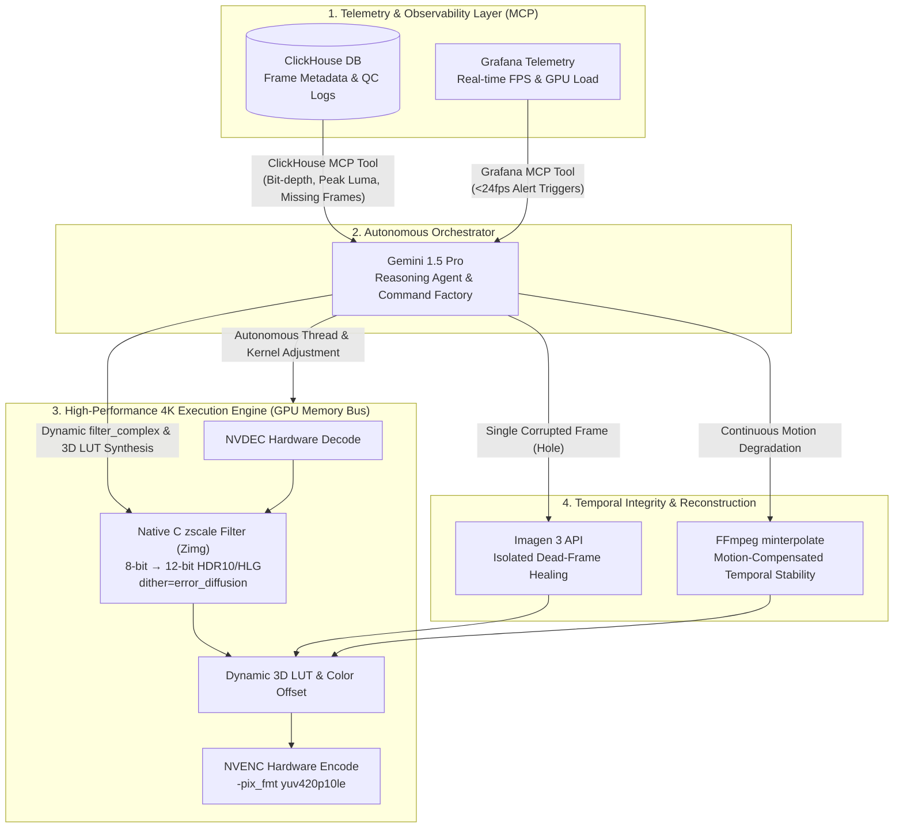

<div align="center">

# 🌌 Project Orihime
### Autonomous Agentic Post-Production Engine for Automated 4K QC, 12-Bit HDR Expansion & Frame-Level Reconstruction

[](https://github.com/Kushal25Gupta/Orihime)
[](https://deepmind.google/technologies/gemini/)
[](https://ffmpeg.org/)
[](https://clickhouse.com/)
[](https://deepmind.google/technologies/imagen-3/)

</div>

---

## 📖 Overview

**Project Orihime** is an autonomous, agentic post-production engine engineered for automated quality control (QC) and high-throughput asset reconstruction. Rather than relying on brittle static scripts or slow Python pixel-manipulation loops, Orihime leverages **Gemini 1.5 Pro** as a real-time reasoning orchestrator via the **Model Context Protocol (MCP)**.

By continuously ingesting frame-accurate telemetry from **ClickHouse** and runtime rendering metrics from **Grafana**, Orihime performs surgical video corrections, 8-bit to 12-bit HDR expansion, and dual-mode frame healing—delivering **4K 60fps throughput** directly on the GPU memory bus.

---

## 🏗️ System Architecture



---

## ⚡ Core Technical Pillars

### 1. Agentic Orchestration & MCP Integration
The core of Orihime is a reasoning agent, not a static pipeline. **Gemini 1.5 Pro** utilizes the **Model Context Protocol (MCP)** to act as an autonomous decision-maker across three critical domains:

* **ClickHouse MCP Tool (Frame-Level QC & Color Math):**
  Gemini queries ClickHouse to retrieve frame-by-frame metadata, including bit-depth analysis, peak brightness (Luma/Chroma) levels, and missing frame sequences. Rather than merely reporting anomalies, Gemini uses these telemetry results to mathematically calculate required color offsets.
* **Grafana MCP Tool (Self-Healing Runtime Observability):**
  Gemini monitors real-time rendering telemetry. If rendering performance dips below **24fps** during a 4K reconstruction pass, the agent autonomously adjusts the FFmpeg threading model or switches filter kernels to maintain system stability.
* **Dynamic Command Generation ("Command Factory"):**
  The agent dynamically synthesizes complex FFmpeg `filter_complex` strings. Based on its QC analysis, Gemini computes custom **3D LUT coefficients** and dynamically generates `zscale` filter parameters for precise **HDR10/HLG** mapping.

---

### 2. High-Performance 4K Processing Strategy
To eliminate the traditional 4K post-production bottleneck, Project Orihime completely bypasses Python-based pixel manipulation. All mathematical heavy lifting is offloaded to native C implementations and GPU hardware acceleration:

* **Native C-Filters (`zscale` / Zimg):**
  Utilizes FFmpeg's native `zscale` filter (implementing the high-performance C++ `Zimg` library) for high-bit-depth image scaling, colorspace conversion, and bit-depth expansion (**8-bit to 12-bit**).
* **Zero NumPy/OpenCV Overhead:**
  Pixel-level math is executed strictly via compiled FFmpeg bitstream filters and custom 3D LUTs. This guarantees **4K 60fps throughput**—a performance tier impossible to achieve with interpreted Python loops or CPU-bound NumPy arrays.
* **End-to-End GPU Acceleration:**
  Targets **NVENC/NVDEC** hardware acceleration paired with `cuda` filters for color space conversion, ensuring video frame buffers remain on the **GPU memory bus** throughout the entire reconstruction pipeline.

---

### 3. Reconstruction & Temporal Integrity (Anti-"Boiling" Engine)
AI video tools frequently suffer from temporal "boiling" or flickering when regenerating sequences. Orihime explicitly differentiates between isolated frame dropouts and continuous temporal degradation:

| Failure Mode | Detection Pattern | Reconstruction Strategy | Technical Rationale |
| :--- | :--- | :--- | :--- |
| **Isolated Dead Frame** | Single corrupted or missing frame ("hole" in timeline) | **Imagen 3 API** | Invokes Imagen 3 with a frame-accurate reference prompt to regenerate the exact missing asset without altering adjacent frames. |
| **Continuous Degradation** | Multi-frame motion corruption or continuous dropouts | **FFmpeg `minterpolate`** | Avoids per-frame AI generation; applies motion-compensated pixel prediction to preserve vector consistency and eliminate temporal flicker. |

---

## 🏛️ Technical Architecture Matrix

| Component | Primary Responsibility | Technology Stack |
| :--- | :--- | :--- |
| **Brain** | Intent reasoning, QC telemetry interpretation & tool use | **Gemini 1.5 Pro** |
| **Telemetry** | Frame-by-frame metadata & QC data storage (Luma, Chroma, Frame ID) | **ClickHouse (via MCP)** |
| **Observability** | Real-time runtime performance tracking & FPS monitoring | **Grafana (via MCP)** |
| **Execution Engine** | High-speed 4K 60fps video processing & color volume expansion | **FFmpeg (C-filters, `zscale`, CUDA)** |
| **Frame Healer** | Surgical single-frame asset reconstruction | **Imagen 3** |
| **Storage** | Raw 4K video assets & intermediate high-bit-depth streams | **Local NVMe / Fast Scratch Disk** |

---

## 🔬 Color Science & Implementation Standards

To guarantee broadcast-grade visual fidelity and prevent quantization artifacts during HDR reconstruction, Project Orihime enforces two strict execution constraints:

1. **Error-Diffusion Dithering (`dither=error_diffusion`):**
   Whenever the `zscale` filter upscales bit-depth from **8-bit to 12-bit**, the command generator enforces `dither=error_diffusion`. This prevents color banding across smooth gradients in the final HDR10/HLG output.
2. **High-Bit-Depth Pixel Formats (`-pix_fmt yuv420p10le`+):**
   All FFmpeg pipelines synthesized by Gemini 1.5 Pro prioritize `-pix_fmt yuv420p10le` (or higher 12-bit formats) to preserve the full integrity of the reconstructed color volume.

---

## 🗓️ 72-Hour Sprint Implementation Roadmap

### Day 1: Infrastructure & Data Ingest
* **Hour 0–6:** Provision local environment with custom FFmpeg build (compiled with `zscale` / `libzimg` and NVIDIA `CUDA` / `NVENC` support).
* **Hour 6–12:** Initialize ClickHouse database and define frame-level telemetry schema (`Frame ID`, `Luma`, `Chroma`, `Bit-Depth`).
* **Hour 12–24:** Implement MCP server connectors for **ClickHouse** and **Grafana** to expose real-time telemetry and QC logs to **Gemini 1.5 Pro**.

### Day 2: Agentic Logic & Command Synthesis
* **Hour 24–30:** Engineer system prompts for Gemini 1.5 Pro to interpret QC failure patterns from ClickHouse telemetry logs.
* **Hour 30–42:** Build the **"Command Factory"**—the autonomous execution layer where Gemini synthesizes and executes complex FFmpeg 3D LUT and `filter_complex` commands.
* **Hour 42–48:** Integrate the **Imagen 3 API** module for isolated single-frame reconstruction.

### Day 3: Integration, QC, & Live Demonstration
* **Hour 48–60:** Fine-tune FFmpeg `minterpolate` motion interpolation parameters to guarantee seamless optical transitions between original and healed frames.
* **Hour 60–66:** Stress-test the 4K 60fps pipeline; optimize `zscale` filter kernels and GPU thread allocation under simulated <24fps load drops.
* **Hour 66–72:** Finalize the interactive demonstration UI (Streamlit) to visualize Gemini 1.5 Pro's live chain-of-thought reasoning alongside the reconstructed 4K HDR output.

---

## 🚀 Quick Start & Judge Verification

### 1. Install & Run Automated Verification Suite
```bash
# Install package in editable mode with dev dependencies
pip install -e ".[dev]"

# Run automated verification suite (ClickHouse/Grafana MCP, Section 6 Color Science, 3D LUT & Command Factory)
pytest -v
```

### 2. Run Autonomous Reconstruction CLI
```bash
# Normal 59.94 fps execution pass
python -m orihime.cli --asset 4k_master_reel_01 --fps 59.94

# Simulate <24fps telemetry drop to watch Gemini 1.5 Pro autonomously expand threads & switch zscale kernels
python -m orihime.cli --asset 4k_master_reel_01 --fps 18.5
```

### 3. Launch Broadcast Streamlit Control Room UI
```bash
streamlit run src/orihime/ui/app.py
```

---

## 📜 Changelog & Audit Trail

Every architectural modification, implementation step, and commit is tracked with strict UTC timestamps in [`CHANGELOG.md`](./CHANGELOG.md).
